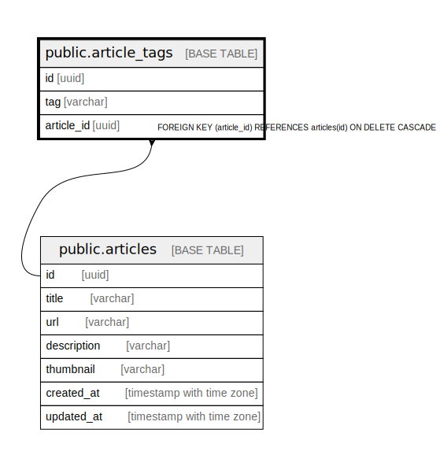

# public.article_tags

## Description

## Columns

| Name | Type | Default | Nullable | Children | Parents | Comment |
| ---- | ---- | ------- | -------- | -------- | ------- | ------- |
| id | uuid |  | false |  |  |  |
| tag | varchar |  | false |  |  |  |
| article_id | uuid |  | false |  | [public.articles](public.articles.md) |  |

## Constraints

| Name | Type | Definition |
| ---- | ---- | ---------- |
| article_tags_articles_tags | FOREIGN KEY | FOREIGN KEY (article_id) REFERENCES articles(id) |
| article_tags_pkey | PRIMARY KEY | PRIMARY KEY (id) |

## Indexes

| Name | Definition |
| ---- | ---------- |
| article_tags_pkey | CREATE UNIQUE INDEX article_tags_pkey ON public.article_tags USING btree (id) |
| articletag_tag_article_id | CREATE UNIQUE INDEX articletag_tag_article_id ON public.article_tags USING btree (tag, article_id) |
| articletag_tag | CREATE INDEX articletag_tag ON public.article_tags USING btree (tag) |
| articletag_article_id | CREATE INDEX articletag_article_id ON public.article_tags USING btree (article_id) |

## Relations

---

> Generated by [tbls](https://github.com/k1LoW/tbls)
