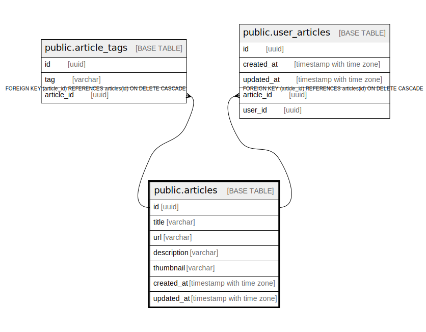

# public.articles

## Description

## Columns

| Name | Type | Default | Nullable | Children | Parents | Comment |
| ---- | ---- | ------- | -------- | -------- | ------- | ------- |
| id | uuid |  | false | [public.article_tags](public.article_tags.md) |  |  |
| title | varchar |  | false |  |  |  |
| url | varchar |  | false |  |  |  |
| description | varchar |  | false |  |  |  |
| thumbnail | varchar |  | false |  |  |  |
| created_at | timestamp with time zone |  | false |  |  |  |
| updated_at | timestamp with time zone |  | false |  |  |  |

## Constraints

| Name | Type | Definition |
| ---- | ---- | ---------- |
| articles_pkey | PRIMARY KEY | PRIMARY KEY (id) |

## Indexes

| Name | Definition |
| ---- | ---------- |
| articles_pkey | CREATE UNIQUE INDEX articles_pkey ON public.articles USING btree (id) |
| articles_url_key | CREATE UNIQUE INDEX articles_url_key ON public.articles USING btree (url) |
| article_title | CREATE INDEX article_title ON public.articles USING btree (title) |

## Relations

---

> Generated by [tbls](https://github.com/k1LoW/tbls)
