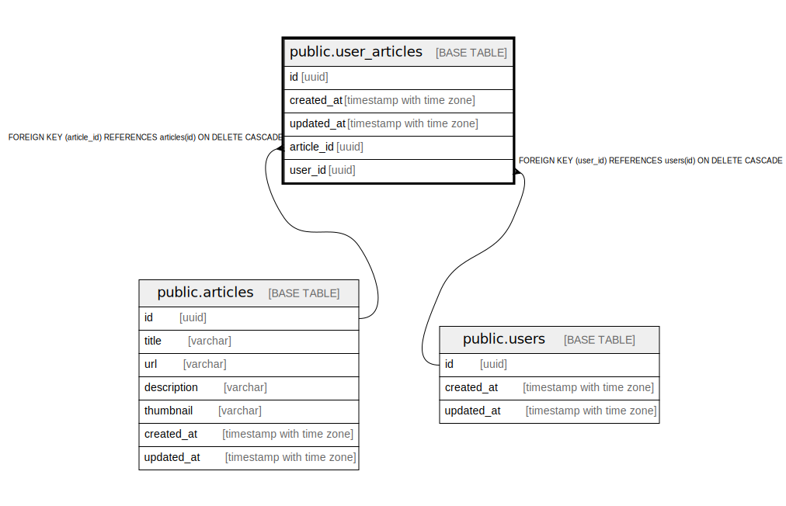

# public.user_articles

## Description

## Columns

| Name | Type | Default | Nullable | Children | Parents | Comment |
| ---- | ---- | ------- | -------- | -------- | ------- | ------- |
| id | uuid |  | false |  |  |  |
| created_at | timestamp with time zone |  | false |  |  |  |
| updated_at | timestamp with time zone |  | false |  |  |  |
| article_id | uuid |  | false |  | [public.articles](public.articles.md) |  |
| user_id | uuid |  | false |  | [public.users](public.users.md) |  |

## Constraints

| Name | Type | Definition |
| ---- | ---- | ---------- |
| user_articles_articles_user_articles | FOREIGN KEY | FOREIGN KEY (article_id) REFERENCES articles(id) ON DELETE CASCADE |
| user_articles_users_user_articles | FOREIGN KEY | FOREIGN KEY (user_id) REFERENCES users(id) ON DELETE CASCADE |
| user_articles_pkey | PRIMARY KEY | PRIMARY KEY (id) |

## Indexes

| Name | Definition |
| ---- | ---------- |
| user_articles_pkey | CREATE UNIQUE INDEX user_articles_pkey ON public.user_articles USING btree (id) |
| userarticle_user_id_article_id | CREATE UNIQUE INDEX userarticle_user_id_article_id ON public.user_articles USING btree (user_id, article_id) |
| userarticle_user_id | CREATE INDEX userarticle_user_id ON public.user_articles USING btree (user_id) |

## Relations

---

> Generated by [tbls](https://github.com/k1LoW/tbls)
